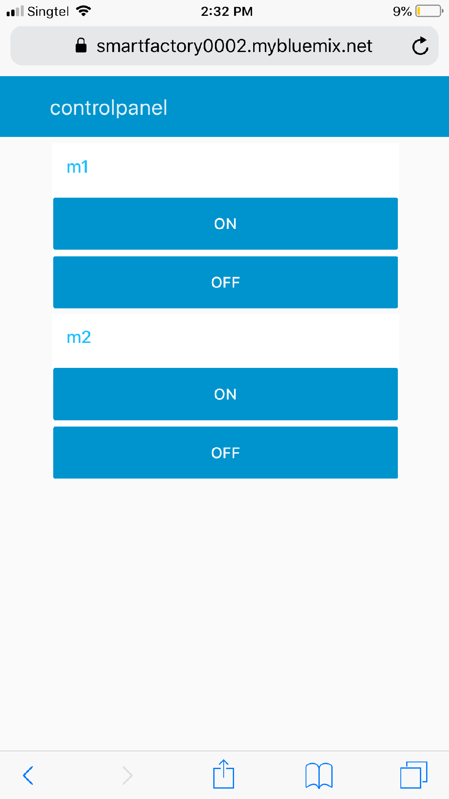
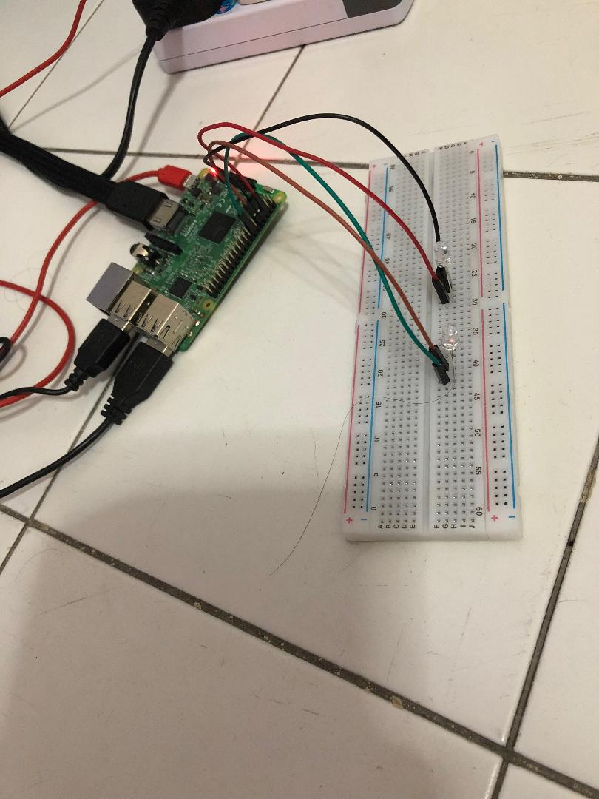

UserEnd_control_smartmachines_RaspberryPi_Node-RED
==================================================

Smart machines are controlled in the other end by the front-end user interface.
Here Node-RED, is used as a front-end which is deployed in IBM cloud.

When we press ON button in M1, one LED which is connected with Raspberry pi will
glow, and for OFF, led will be off. It is in same way for M2 also.

Requirements:

-   Raspberry Pi

-   2 LEDs

-   PC and Jump Wires

